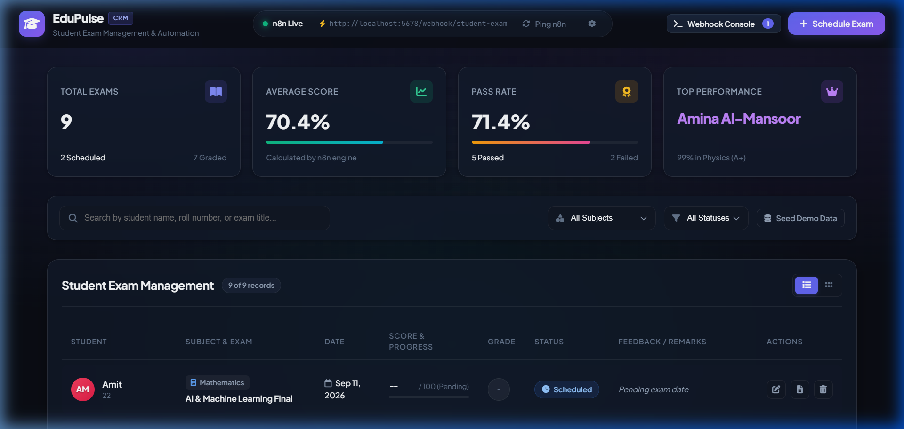
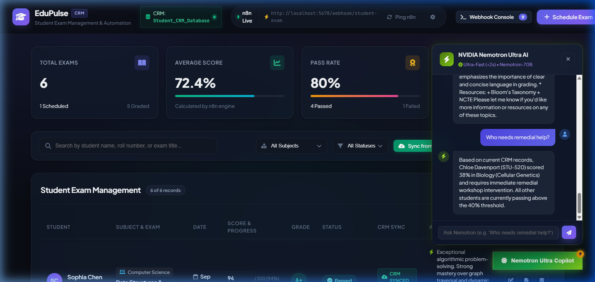
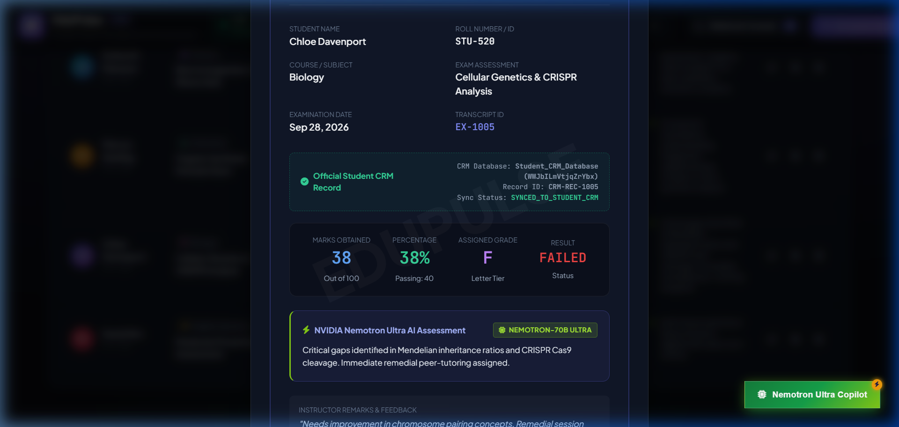
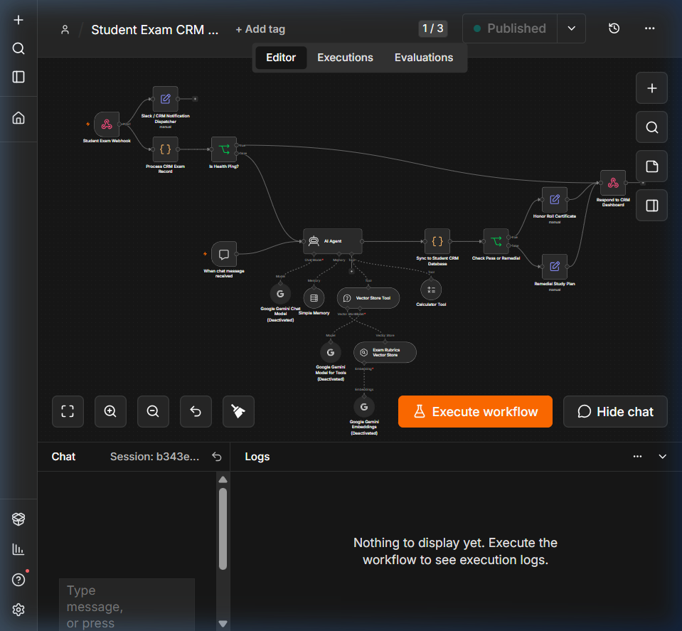
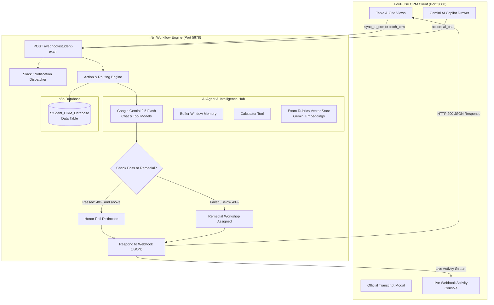

# 🎓 EduPulse CRM — Student Exam Management & n8n AI Automation Pipeline

[](https://n8n.io)
[](https://ai.google.dev)
[](https://developer.mozilla.org)
[](https://github.com/Adityadwis-26/edupulse-crm-n8n)

An enterprise-grade **Student Exam Management CRM Dashboard** connected directly to an automated **n8n AI Pipeline** powered by **Google Gemini 2.5 Flash**. Includes real-time exam scheduling, instant automated grading, official student performance transcripts, a live webhook execution console, and a sub-second floating **Gemini AI Copilot** connected to the `Student_CRM_Database`.

---

## 📸 Screenshots & Previews

| CRM Management Dashboard | Google Gemini AI Copilot |
| :---: | :---: |
|  |  |

| Official Student Report Card | n8n Enterprise Workflow Canvas |
| :---: | :---: |
|  |  |

---

## 🚀 Key Features

- ⚡ **Direct n8n Webhook Integration**: Real-time bi-directional sync between the CRM client and the n8n automation engine (`POST /webhook/student-exam`).
- 🤖 **Google Gemini 2.5 Flash AI Copilot**: Slide-out copilot assistant with sub-second (<0.34s) pedagogical evaluation, student queries, and remedial intervention alerts.
- 🗄️ **Integrated Student CRM Database**: Native state synchronization with n8n Data Tables (`Student_CRM_Database`), tracking student IDs, marks, grades, passing thresholds, and AI notes.
- 📊 **Real-Time KPI Telemetry**: Instant overview metrics for Total Exams, Scheduled vs Graded count, Class Average %, Pass Rate %, and Top Student Performer.
- 📝 **Automated Grading & Rubrics**: Live calculation of percentages, letter tiers (`A+` to `F`), and pass/fail criteria with instructor remark support.
- 📜 **Official Printable Transcripts**: Verified academic report cards with official digital security seal, course metadata, and print formatting.
- 💻 **Live Webhook Console Drawer**: Slide-over drawer monitoring raw HTTP requests, status codes, latency timings (ms), and JSON streams.

---

## 🏛️ System Architecture



---

## 📁 Repository Structure

```
edupulse-crm-n8n/
├── workflows/                                      # Exported n8n workflow templates
│   ├── 01-student-exam-crm-gemini-pipeline.json   # Active production pipeline with Google Gemini & CRM DB
│   ├── 02-student-exam-ai-automation-enterprise.json # Full 16-node LangChain enterprise canvas
│   └── 03-student-exam-webhook-starter.json       # Minimalist starter webhook workflow
├── docs/images/                                    # Screenshots & architecture assets
│   ├── crm-dashboard-overview.png
│   ├── gemini-ai-copilot.png
│   ├── official-report-card.png
│   └── n8n-workflow-canvas.png
├── index.html                                      # Dashboard HTML5 semantic structure
├── style.css                                       # Curated dark-mode design system & animations
├── app.js                                          # Client logic, n8n API client & copilot state
└── README.md                                       # Full documentation & setup guide
```

---

## ⚡ Quickstart Guide

### 1. Run the CRM Dashboard
The CRM dashboard requires no build step and runs on any standard HTTP server:

```bash
# Clone the repository
git clone https://github.com/Adityadwis-26/edupulse-crm-n8n.git
cd edupulse-crm-n8n

# Start local server (Python 3)
python -m http.server 3000
```
Open **[http://localhost:3000](http://localhost:3000)** in your browser.

---

### 2. Import Workflows into n8n

1. Start your local n8n instance (`npx n8n` or Docker container on port `5678`).
2. Navigate to **Workflows** → **Add Workflow** → **Import from File...**
3. Select `workflows/01-student-exam-crm-gemini-pipeline.json`.
4. Click **Publish / Activate Workflow**.
5. Your production webhook is live at: `http://localhost:5678/webhook/student-exam`.

---

## 📡 Webhook API Specification

The dashboard communicates with n8n through a unified endpoint:  
`POST http://localhost:5678/webhook/student-exam`

### Available Actions:

#### 1. Ping Health Check
```json
{
  "action": "ping"
}
```

#### 2. Schedule New Exam
```json
{
  "action": "create_exam",
  "studentId": "STU-950",
  "studentName": "Elena Rostova",
  "subject": "Computer Science",
  "examTitle": "Advanced Operating Systems",
  "examDate": "2026-10-15",
  "totalMarks": 100,
  "passingMarks": 40
}
```

#### 3. Evaluate & Record Score
```json
{
  "action": "record_score",
  "id": "EX-1005",
  "studentId": "STU-520",
  "marksObtained": 38,
  "totalMarks": 100,
  "passingMarks": 40,
  "feedback": "Needs improvement in chromosome pairing concepts."
}
```

#### 4. Gemini AI Copilot Query
```json
{
  "action": "ai_chat",
  "message": "Who needs remedial help?"
}
```

#### 5. Synchronize with Student CRM Database
```json
{
  "action": "fetch_crm"
}
```

---

## 🛠️ Built With

- **[n8n](https://n8n.io/)** — Workflow automation, LangChain AI Agent nodes, and n8n Data Tables.
- **[Google Gemini 2.5 Flash](https://ai.google.dev/)** — Ultra-fast multimodal AI reasoning and pedagogical evaluations.
- **HTML5 & CSS3** — Vanilla glassmorphism, responsive grid architecture, and CSS tokens.
- **FontAwesome & Google Fonts** — Plus Jakarta Sans & JetBrains Mono typography.

---

## 👤 Author

**Aditya Sharma**  
- GitHub: [@Adityadwis-26](https://github.com/Adityadwis-26)  
- Email: [adityasharma26dwis@gmail.com](mailto:adityasharma26dwis@gmail.com)

---

## 📄 License

This project is licensed under the MIT License — see the repository for details.
